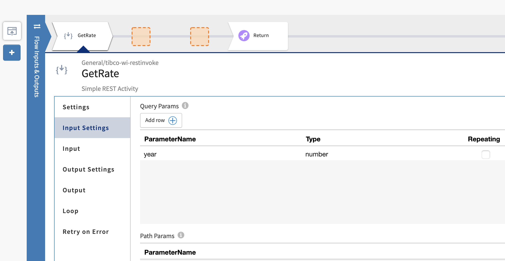

# 3. Build and Deploy Your API #

In this section you'll create a Flogo app that implements a process API that creates a quotation, by first invoking the system API that calculates the rate, then pushing to Salesforce the contact details of the requester, and finally sending a welcome text message to the requester using Twilio services.

* Flogo Apps in TIBCO Cloud Integration
    * Create the Skeleton Flogo App from the API Specification
    * Implement the Flogo App
    * Push the Flogo App to TIBCO Cloud and Test It

## 3.1 Flogo Apps in TIBCO Cloud Integration ##

In this lab you'll implement a process API that creates a qotation, by first invoking the system API that gets a rate from the pricing engine, then invoking a system API that create a quotation in Salesforce.

You will first create a "skeleton" Flogo app from the **Quotation** API specification. Then you will implement the flow with the system API and salesforce calls, to finally push the Flogo app and test it.

### 3.1.1 Getting Ready ###

To be able to create the "skeleton" Flogo app from the **Quotation** API specification, do the following:

1. Navigate to the API specifications by clicking on the **API Specs** menu item.
2. Select the group you've created the **Quotation** API specification in, e.g. **MyTCIWorkshop**.
3. Your screen should look similar to:

    
    
#### Set up Salesforce connection ####

From TIBCO Cloud home page, navigate to _Integration_ hexagon, then _Integration Apps_ section.

Go to _Connections_ tab.


Click on add connection 
Type Salesforce in the search field and click on **Salesforce Connector**


Give it the Name "SalesforceConnection" and click on login. You will be redirected to salesforce.com. Use tci.workshop.0320@gmail.com/*** credentials, and authorise access.


**Your Salesforce connector is now ready for use across TIBCO Cloud**.

#### Set up Twilio connection ####
_What is Twilio?
Twilio is a cloud communications platform as a service company based in San Francisco, California. Twilio allows software developers to programmatically make and receive phone calls, send and receive text messages, and perform other communication functions using its web service APIs._

Go to _Connections_ tab.

Click on add connection

Type Twilio in the search field and click on **Twilio Connector**


Give it a name: TwilioConnection

Select False under _Test Connection_

Account SID: ***

Auth Token: ***

Click on Connect


### 3.1.2 How to Do It: Create the Skeleton Flogo App from the API Specification ###

To create a "skeleton" Flogo app from the **Quotation** API specification, do the following:

1. Go to the _Apps_ tab

2. Click on Create/Import button on the page's upper left

    
    
3. Choose/Clik Flogo from the pop-up left menu, then click on the _create New App_ button

4. Change the name of the app by typing the new name in the upper-right side of the screen. _(Spaces are not allowed in the app name)_

    
    
5. Click on the _Create_ button to create your first flow/API

6. To create the skeleton app from the API specification, select _Swagger Specification_ from the pop-up left menu _(under start with section)_

7. Here, you can either upload your specification file, or use specifications modelled on TIBCO Cloud. Let's use the _Quotation API_ specification we just created. Select it and click on _Create_
    
     

8. The skeleton app is now created with the input/output of each method populated. Your screen should look like this:

     


### 3.1.3 How to Do It: Implement the Flogo App ###

In this lab, you'll create a process API that creates a quotation by making calls to the system API (Pricing Engine) and to salesforce using _Flogo Connector for Salesforce_. The address of first system API call is provided below. 


To implement the API business logic, do the following:

1. Click on the _postQuotation_POST_ flow.

2. To enable data to flow between the trigger and the flow, you first need to map the trigger output to the flow input, and flow data to the trigger reply. Click on the  icon to open the configuration of the **ReceiveHTTPMessage** trigger.

    

3. Map the trigger output to the flow input as follows:

    

4. Map the flow data to the trigger reply as follows:

    

5. Close the trigger configuration screen, and move the **Return** tile at least 3 positions to the right. 

    

6. Create a first activity, by clicking on the left-most `+` and navigate through **General > Invoke REST Service**. Configure this activity as follows:

    1. Give it a name: **GetRate**.
    2. In the **Settings** section, specify the following fields:

        | Field         | Value           |
        | ------------- | --------------- |
        | Method  | GET |
        | URL | `https://eu-west-1.integration.cloud.tibcoapps.com:443/ecdqf65m3vtc2xkldj3mepxllqjswpjb/Engine-rate/engine/rate` |
        | Use certificate for verification | `false` |

    3. In the input settings section, add a parameter in the query params listing. Name it **year** and make it of type **number**
    
    4. In the **Input** section, create the following mapping:

        | Activity Input | Upstream Output |
        | -------------  | --------------- |
        | `queryParams.year` | `$flow.body["birth-year"]` |
	
	

    4. In the **Output Settings** section, ensure the **Response Type** is set to `application/json`, and copy the following json structure into the **Response Schema**:

        ```json
        {
  			"rate-per-month": 105,
  			"rate-per-year": 1234
		}
        ```

6. Save and Close the activity configuration screen, and create a second activity, by clicking on the next `+` and navigate through **Salesforce > Create**. Configure this activity as follows:

	1. Give it a name: **CreateQuotation**.
	2. In the **Settings** section, specify the following fields:

        | Field         | Value           |
        | ------------- | --------------- |
        | Connection  | SalesforceConnection |
        | Object | `Quotation__c` |

	3. In the **Input** section, map the following fields:

        | Parameter Name | Type |
        | -------------  | --------------- |
        | input/Quotation__c/records | array.forEach(array.create("one item array")) |
        | FullName__c | string.concat($flow.body["first-name"]," ", $flow.body["last-name"]) |
        | Email__c | $flow.body.email |
        | Yearly_Price__c | $activity[GetRate].responseBody["rate-per-year"] |
        | Monthly_Price__c | $activity[GetRate].responseBody["rate-per-month"] |
        | Broker_Organisation__c | $flow.body.broker |
        | Phone_Number__c | $flow.body.phone|

	4. **Save** and close the activity.

7. Create an additional activity, by clicking on the next `+` and navigate through **Twilio > Twilio Messages**. Configure this activity as follows:
	1. In the **Settings** section, pick TwilioConnection from the connection dropdown list and Send Message from the action dropdown list.
	2. In the **Input** section create the mapping for the following fields:
	
		|    Field        | Value           |
		| ------------- | --------------- |
	    | From | "16163845018" |
	    | To | string.concat("+33", string.substringAfter($flow.body.phone, "0")) |
	    | Body | string.concat("Bonjour,\n Suite à votre demande de devis, nous avons le plaisir de vous communiquer un tarif annuel de ", coerce.toString($activity[GetRate].responseBody["rate-per-year"]), ".\n Le service MyCompany")|

9. Close the activity configuration screen, and create an additional activity, by clicking on the next `+` and navigate through **General > Configure HTTP Response**. Configure this activity as follows:

    1. In the **Settings** section, pick code 200 from pick list
    2. In the **Input** section, create the mapping for the following fields:

        | Field         | Value           |
        | ------------- | --------------- |
        | input/body/price-per-year  | $activity[GetRate].responseBody["rate-per-year"] |
        | input/body/price-per-month | $activity[GetRate].responseBody["rate-per-month"] |

    
10. Close the activity configuration screen, and configure the **Return** activity as follows:

    1. In the **Input** section, create the following mapping:

        | Activity Input | Upstream Output |
        | -------------  | --------------- |
        | `code` | `200` |
        | `responseBody` | `$activity[ConfigureHTTPResponse].response` |

11. Save and Close the activity configuration screen. Your flow looks something like:

    

### 3.1.4 How to Do It: Push the Flogo App to TIBCO Cloud and Test It ###

To push the Flogo app and test it, do the following:

1. Go back to the trigger view by clicking on the back button  

2. Click the **Push** button. Once deployment is finished, the app will be in state _Stopped_. To run it, hover over the number box, then using the up & down arrows increase the number from 0 to 1 and click on scale.

    

3. Once the **quotation_1_0_flogo_app** app is running, click on the **Endpoints** tab, then click on **Test**

4. Test the **quotation_1_0_flogo_app** app by filling out a value in the required fields, and clicking on the **Try it out!** button. Modify the parameters, especially the birth year, email and phone number so you can receive the text message on your phone.

## 3.2 See Also ##

**BusinessWorks (Cloud Integration)**

* [TIBCO Cloud Integration: Getting Started with BusinessWorks Applications](https://community.tibco.com/wiki/tibco-cloud-integration-getting-started-businessworks-applications)
* [TIBCO Business Studio™ - Cloud Edition](https://integration.cloud.tibco.com/docs/bw/index.html)
* [TIBCO ActiveMatrix BusinessWorks™ Plug-ins](https://integration.cloud.tibco.com/docs/connectors/index.html)
* [TIBCO® Cloud Integration Frequently Asked Questions](https://community.tibco.com/wiki/tibcor-cloud-integration-frequently-asked-questions)

**Flogo (Cloud Integration)**

* [TIBCO Cloud Integration: Getting Started with Flogo](https://community.tibco.com/wiki/tibco-cloud-integration-getting-started-flogo)
* [TIBCO Flogo® apps](https://integration.cloud.tibco.com/docs/flogo/index.html)
* [TIBCO Flogo® Connectors](https://integration.cloud.tibco.com/docs/flogo_connectors/index.html)

**Project Flogo**

* [Project Flogo™ Community Wiki](https://community.tibco.com/wiki/project-flogo-community-wiki)
* [Project Flogo](http://www.flogo.io/)
* [Project Flogo Documentation](https://tibcosoftware.github.io/flogo/)
* [Project Flogo Github Repos](https://github.com/project-flogo)

## 3.3 What's Next ##

[Distribute & Manage your API](003.md)
