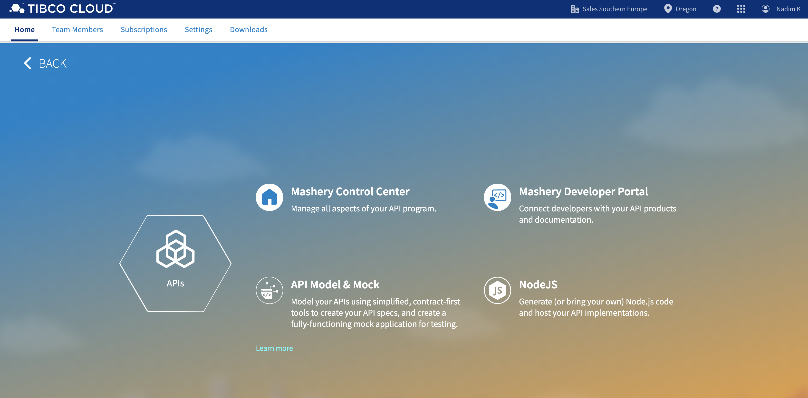
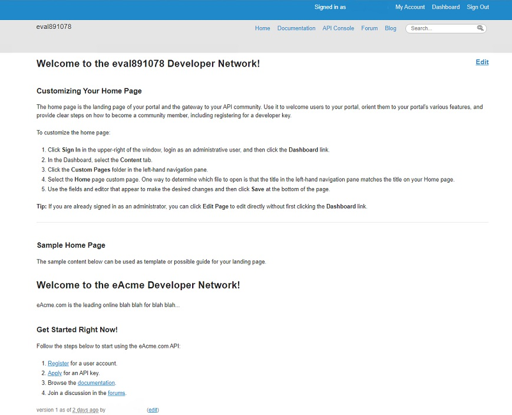
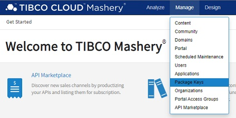
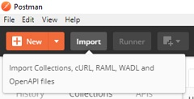
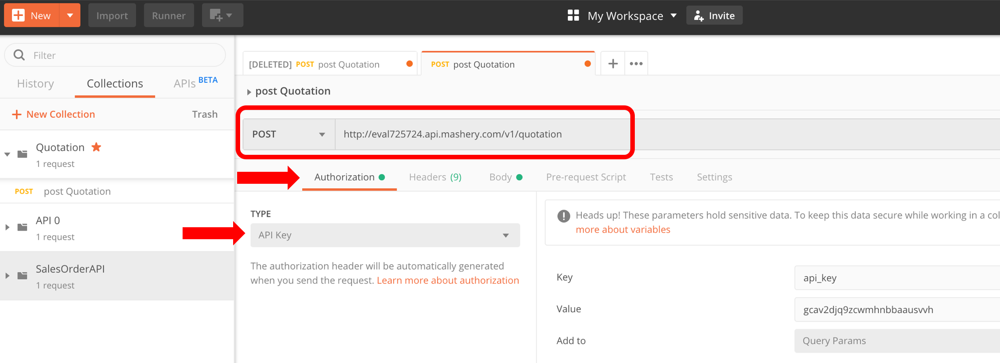
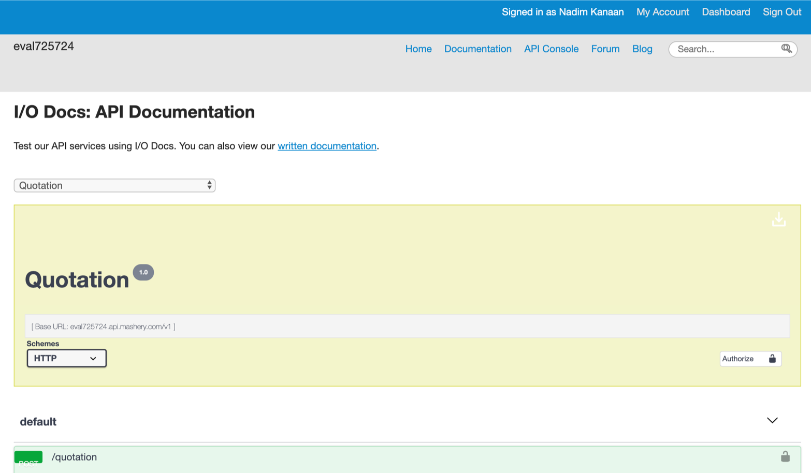

# 5 Testing your APIs #

## 5.1 Register an Application for an API Key ##

In the lab, you will register an application for the managed Quotation API. Upon registration, you will be provided with an API Key (secret) that will allow you to use/test the API. 

### 5.1.1 How to Do It ###

In order to register for an API key, do the following:

1. Navigate to the APIs section:

    

2. Click on **Developer Portal** so your screen looks like this:

    

3. From the top menu, click on **My Account**, and click on **Applications** in the next screen.

    

4. Click the **Create a New Application** button, and specify the following values in the next form:

    | Name | Value |
    | ---- | ----- |
    | Name of your application | QuotationApp |
    | Web Site | `http://www.mycompany.com` |

    Ensure that the **Issue a new key for QuotationPackage** and **I agree to the terms of service** are checked, and **BasePlan** is selected. Then click the **Register Application** button.

    

5. Copy and save the API key from the next screen (**Application Registered!**)

6. To verify that the API key is enabled, click on **Dashboard** in the top menu. In the next screen, select **Manage > Package Keys** from the top menu bar

    

    and verify that the API key is enabled.

    

    If the key is not enabled, select the API key, change the **Status** to **Enabled**, and save the changes.

## 5.2 Test the API using Postman ##

In this lab, you'll first edit and save a Swagger specification for the managed Quotation API, and then import it into Postman so you can test the managed API using the API key.

### 5.2.1 How to Do It ###

1. Start Postman, and import the `QuotationAPI-Mashery.json` file your exported earlier:

    

2. Select the request from the **Quotation**. Replace ~~{BaseURL}/quotation~~ by http://evalxxxxxx.api.mashery.com/v1/quotation. 
_Note that this is the public endpoint you set in Lab 4.2.1-2._ 

3. Under the tab Authorisation, select API Key from the dropdown menu list, and fill in the _value_ text box the Key you copied in _Lab 4.3.1-5_.

4. Test the API.

    
    
## 5.3 Test the API using TIBCO Cloud Mashery API Portal ##

1. Navigate from TIBCO Cloud Home to the **API section**, then to the **Developer Portal**.
2. Go to **API Console** (Top menu).
3. Click on the Authorise button (lock icon)
	
	
	
4. Fill in the form, the value of the API Key you obtained upon registration in the previous lab. Click **Authorize** 
5. Click on **Try it out** and test your API.

## 5.4 See Also ##

* [TIBCO Cloud™ Mashery Documentation](https://docs.mashery.com)
* [TIBCO Mashery® Community Wiki](https://community.tibco.com/wiki/tibco-mashery-community-wiki)

## 5.5 What's Next ##

[Customize your API Portal](005.md)
